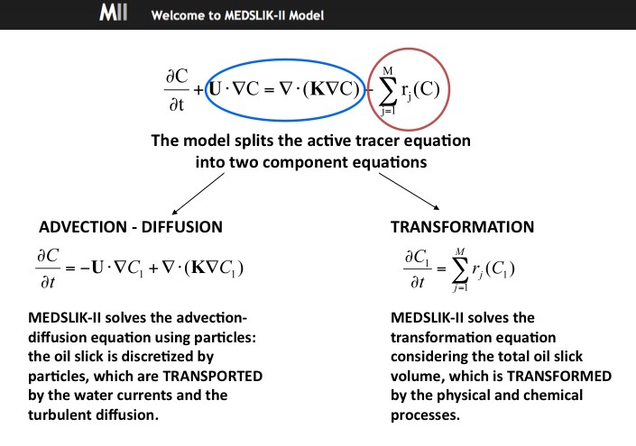

# Model Description

MEDSLIK-II simulates the transport of the surface slick governed by the water currents and by the wind. Oil particles are also dispersed by turbulent fluctuation components that are parameterized with a random walk scheme. In addition to advective and diffusive displacements, the oil spill particles change due to various physical and chemical processes that transform the oil (evaporation, emulsification, dispersion in water column, adhesion to coast). MEDSLIK-II includes a proper representation of high frequency currents and wind fields in the advective components of the lagrangian trajectory model, the introduction of the Stokes drift velocity and the coupling with the remote-sensing data.

## Input and Output

MEDSLIK-II requires as input the oil spill data, the wind field, the sea surface temperature and the three-dimensional sea currents. MEDSLIK-II can make use of atmospheric wind and oceanographic fields (i.e. currents, temperature) from several different sources. The oil spill data required to define a numerical oil spill initial condition are: location, time and area of the spill, as well as the age of the oil spill from initial arrival in the sea. This information can be easily provided to MEDSLIK-II by satellite monitoring systems MEDSLIK-II produces as output the oil properties evolution and the position, every hour and for the next days, of the surface, dispersed oil and of the oil arrived on the coasts.

*Schematic of MEDSLIK-II oil spill model.*

*MEDSLIK-II oil spill model conceptual basis.*

*Output example of a simulation initialized using satellite images:  maps of oil concentration at the surface (black arrows represent the current field and the blue arrow is the wind speed at the centre of the slick). The shape of the slick has been initialized from satellite image data: MEDSLIK-II reads the slick polygonal coordinates from satellite data and distributes the spill parcels randomly into the slick area.*

*MEDSLIK-II has been used to forecast the possible spill of the 2500 tons of oil from the Costa Concordia, assuming a continuous oil release. Every day, until the unloading operations had run out, a bulletin with the forecast scenario for the next 72 hours has been released to the competent authorities. In this movie an example of maps of oil concentration at the surface are displayed: black arrows represent the current field and the blue arrow is the wind speed at the centre of the slick.*
